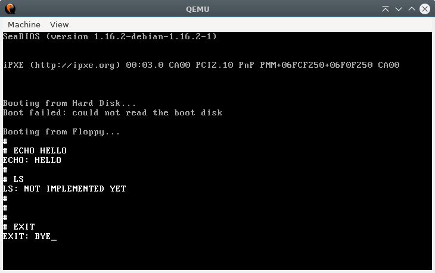
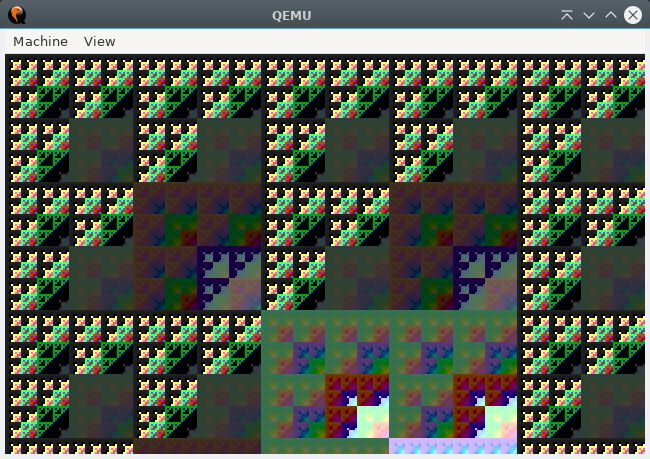

# Simple 32bit OS template
<br>

## Description
A little abstracted 32bit OS template with some function.

This repo is help me to develop some custom OS stuff. Example a game or something else.

But I would like to expand this project a modular way, so I can put moduls what I need in a sertain project.

_(By the way. This is my first real OS dev repo, so do not judge me for some stupid mistake, I am in the learning process in this topic yet.)_

>__Warning!__<br>
In the hdep(hardware depend) folder has the hardware specific code<br>
For whos want run this code on other platform

__This repo is not an OS dev tutorial, just my personal experiace with this topic. If you want to learn more on these pls look the link below in the [referencies](#referencies) section.__

## Tested on these
Linux (Debian)<br>
My machine is x86_64<br>
I was not tested on other OS or hardwares

## Dependencies
( At least for my Makefile )
- Assembler: [nasm](https://www.nasm.us/)
- Compiler: [gcc](https://gcc.gnu.org/)
- Linker: [ld (GNU linker)](https://linux.die.net/man/1/ld)
- hardware emulation: [qemu](https://www.qemu.org/)
- [GNU make](https://www.gnu.org/software/make/)

## Some features
- Very basic memory protection (GDT with flat model)
- Interaction with hardware throught IO ports
- Basic libc, with some function
- Basic keyboard handling with callback abstraction
- VGA Text graphics ( 80x25 )
- It has a timer and its own callback which invoke when the PIT "clock"
- Callbacks for interrupt exceptions
- It build a modular way for separation the backend
- The main kernel when you can initialize that you need
- A basic separated shell
- A bit goofy way to toggle graphics mode at running
- A basic vga 13h mode graphics driver
- __If you want to toggle the graphics mode option, you need to hardcode in the boot_main.asm file. Here:__
```js
[org 0x7c00]

    mov ah, 0x0                     ; graphicsal settings

    ; 0x13 for gaphics mode and 0x2 for text mode
    mov al, 0x13                    

    mov [GRAPHICS_MODE], al         ; save graphics mode for later
    int 0x10                        ; change graphics

    KERNEL_OFFSET equ 0x1000
```

__Shell supperted commands:__
| Command           | Arguments count   | Description                           |
| :---              | :---:             | :---                                  |
| `echo`            | 1                 | print the 1st argument onto the screen|
| `ls`              | 0                 | print "not implemented yet"           |
| `exit`            | 0                 | halt the whole OS                     |
| `clear`           | 0                 | clear the screen                      |
| `random command`  | max 10            | print:... command does not supported. |
| `no command`      | max 10            | just a new line                       |


Probably in the future, I try put this OS in a docker env.

## How to compile and run
Just compile:
```shell
make
```
Compile and run:
```shell
make run
```
Clean all the bin file, except os_img:
```shell
make clean
```
## Shell preview

## Graphics preview
### formula in C syntax :)<br>" ~(i&j)-frames "


## Referencies
- [A little book about os](https://littleosbook.github.io/)
- [Writing a Simple Operating System —
from Scratch pdf](https://www.cs.bham.ac.uk/~exr/lectures/opsys/10_11/lectures/os-dev.pdf)
- [Os dev wiki](https://wiki.osdev.org/Expanded_Main_Page)
- [Write my own bootloader](https://dev.to/frosnerd/writing-my-own-boot-loader-3mld)