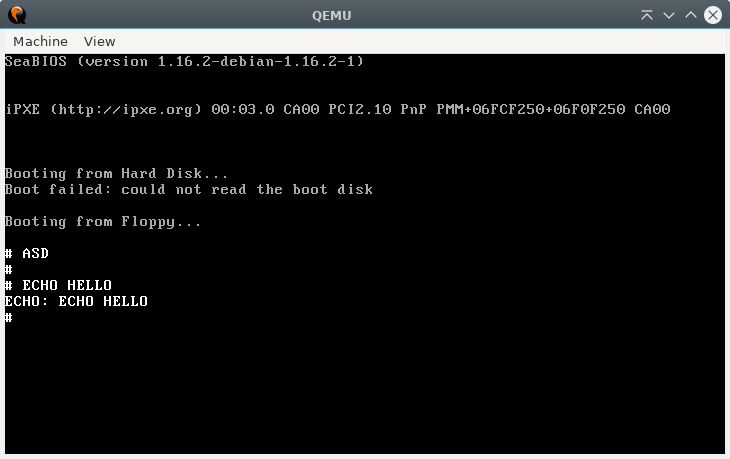

# Simple 32bit OS template
## Description
A little abstracted 32bit OS template with some function

## Specification
I wrote this OS on Linux (Debian)

## Dependencies
( At least for my Makefile )
- Assembler: [nasm](https://www.nasm.us/)
- Compiler: [gcc](https://gcc.gnu.org/)
- Linker: [ld (GNU linker)](https://linux.die.net/man/1/ld)
- hardware emulation: [qemu](https://www.qemu.org/)
- [GNU make](https://www.gnu.org/software/make/)

## What it can do?
- Interaction with hardware throught IO ports
- Basic libc lib, with some function
- Basic keyboard handling with callback abstraction
- VGA Text graphics ( 80x25 )
- It has a timer and its own callback which invoke when the PIT "clock"
- Callbacks for interrupt exceptions
- It build a modular way for separation the backend
- Has a separated shell
- The main kernel when you can initialize that you need

## How to compile and run
Just compile:
```console
make
```
Compile and run:
```console
make run
```
Clean all the bin file, except os_img:
```console
make clean
```
## Shell preview


## Referencies
- [A little book about os](https://littleosbook.github.io/)
- [Writing a Simple Operating System —
from Scratch pdf](https://www.cs.bham.ac.uk/~exr/lectures/opsys/10_11/lectures/os-dev.pdf)
- [Os dev wiki](https://wiki.osdev.org/Expanded_Main_Page)
- [Write my own bootloader](https://dev.to/frosnerd/writing-my-own-boot-loader-3mld)